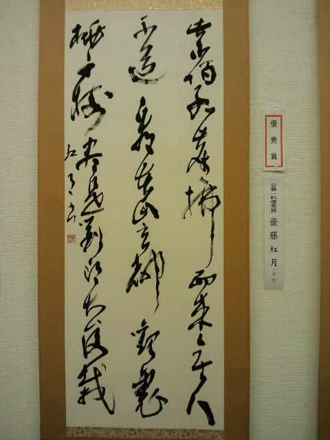

２日連続の仙台 
昨日の仙台は後日改めて 
 
今日の仙台 
表彰式 
 
 
久しぶりに再会した自分の作品 

 
わーい♪優秀賞♪わーい♪ 
 
 
 
腹ごしらえして表彰式へ 

 
ここでさらに食べる。 
 
いくつになっても表彰されるのはうれしいです。 
 
 
勢いづいてshun-ran先生と古着屋さんへ直行。 
あれこれ試着して、お互い明るい色の服を購入。 
 
『書』の話 
『映画』の話 
『人生』の話 
 
師匠とこんなに濃密な話ができるなんて弟子は幸せです。 
 
 
 
目指せ！東京の表彰式！

     