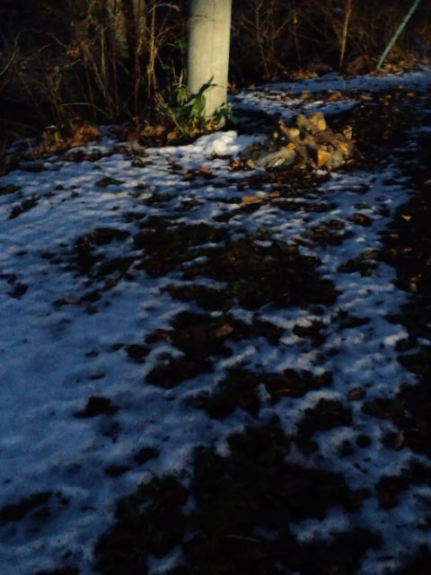

雪 

 
 
 
 
自分を守るために、 
 
人のせいにする 
問題をすり替える 
あたかもそれが原因のように思いこむ 
自分に原因があるわけない 
自分に問題があるわけない 
周りが悪いから自分がつらい思いをしてるんだ 
 
悪いのは自分じゃない 
 
 
私もずっとそう思い続けてきた。 
 
表面上の問題だけを見てその場を取り繕ってきた。 
 
でも自分と向き合うと決めてから、 
「全ての問題、答えは自分の中にある」ことがわかってしまった。 
 
私だけではなく、生きてる人みんなに当てはまること。 
 
 
あるきっかけから父に想いをぶちまけた。 
人生で２度目のこと。 
 
父も黙り込むパターン。 
「何か言いたいことあったら言えばいいじゃん！」と無言の父に対してますます頭にくる。 
 
たぶん、父は家族との向き合い方についてはいまだに試行錯誤。 
愛し愛され方がわからないんだと思う。 
おじいちゃんも愛し愛され方がわからなかったから、 
子どもに（父に）それができなかったのではないか。 
だから父もわからないんだと思う。 
 
娘に対して、息子に対して遠慮しているのがよくわかる。 
私も同じだった。 
どう接していいかわからず、いつも母を間にいれていた記憶しかない。 
 
だからこれからはお互いにちゃんと向き合いなさいと母から言われてるような気もする。 
 
いや、自分でもそれには気づいていたけど心の奥底に封印していた。 
 
徐々に開きつつある扉。 
ちょっとでも開けたからにはちゃんと確かめるんだ私。 
その奥にはどんな感情があるのか。 
 
 
そんなわけで、 
とにかく昨日は頭にきた。 
 
みんなそれぞれが問題をすり替えすぎて、根本的な部分を見ようとしない。 
それをまたまわりが変に気を使い、臭い物には蓋をしろ的な対処法しかしない。 
その場を取り繕うことばかりに一生懸命になり、一見解決したかに見えてもまた同じ問題が起きる。 
そんなの当たり前。解決してないから。 
 
 
行き着くところはそれぞれその人自身の問題。 
 
それをみんなうまく誤魔化しながらやっていこうとするから、だんだんとズレが大きくなっていく。 
 
周りのせいなんかじゃない。 
全部自分の中にあること。 
 
 
私も一連の出来事で、まだ自分は仲裁役・伝言役になろうとしていることがわかった。 
もうそれも必要ない。 
みんなそれぞれ自分でできる力を持っているから。 
見守ることが必要なときもある。 
 
それぞれがそれぞれの『課題』を持ってこの世に生まれてきた。 
それに気づきどう対処していくかで 
人生楽しんでいく人と 
人生こんなもんかと思う人と 
大きく分かれていくんじゃないかな。 
 
 
なんとタイムリーな<a href="http://ameblo.jp/faith-kumiko/entry-10723641965.html#cbox" target="_blank">朝水久美子さん</a>のブログ

     