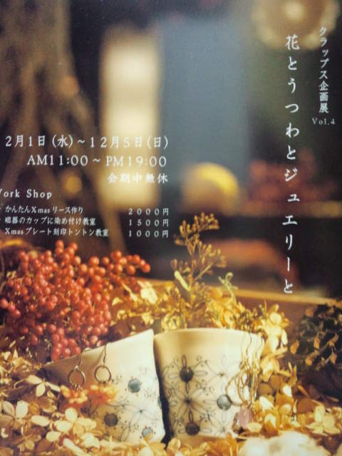
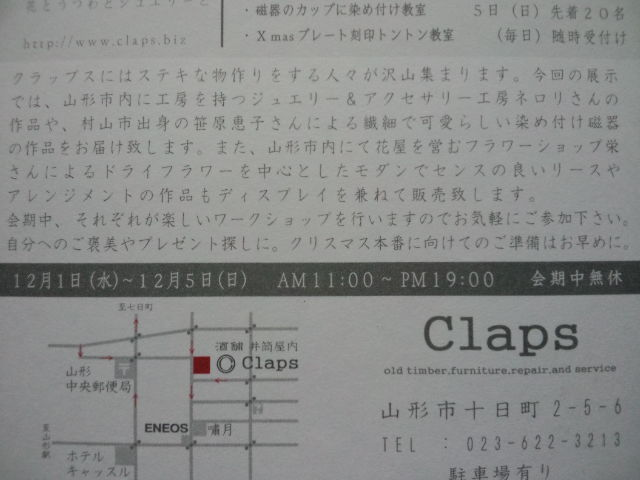
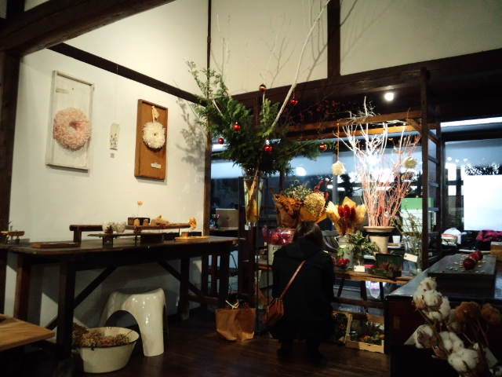

私の大好きな作家さんたちによる 
『花とうつわとジュエリーと』 
が、Claps（クラップス）企画展Vol.4として山形市十日町のClapsさんで開催されてます。 
１２／１～１２／５です。 

 

 
ジュエリー＆アクセサリーのみわちゃん、陶芸家の恵子さん、お花屋さんのゆかこちゃん（ゆかこちゃんには初めてお会いしました） 
 
乙女心をわしづかみされる作品ばかりで、 
見てるだけでも目がハート。 
手に取ると、全部欲しい！と毎回なってしまう・・・ 

 
作る人の人柄がそのまま表れていて、作品を通しても『女性が憧れる女性』を感じ取れます。 
なので、ご本人たちを目の前にすると女神様や観音様の光を浴びるようなポーっとふわわわんとした感覚になります。 
自分の芯がドン！とまっすぐに根付き、自分自身のコンパスを持っているから放てる光なんだろうな。 
 
ここでもいつものようにくつろぎ、 
お菓子をバクバク、 
全く関係のない『グループ魂』の話をして大満足で帰路につく。

     