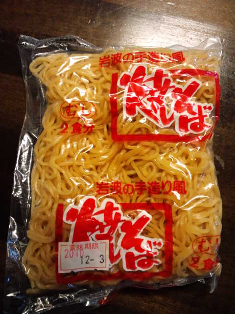

Ｋちゃんと渉さんとうちで待ち合わせ。 
 
先に到着したＫちゃんに 
「今日のお昼ご飯何食べたのー？」と聞くと 
「昨日の焼そば」 
「えー！？私も一昨日の焼そばの残りをお昼に食べたよ！」（この時点でかなりの興奮状態） 
 
 
どこのメーカーか確認したところ・・・ 
なんと・・・ 

 
私もＫちゃんも『岩波の焼そば』！！！（興奮MAX） 
この焼そば、他のものよりちょっぴり太めかためですんっごくおいしいんです。 
 
 
渉さん到着。 
「渉さん今日のお昼何食べたー？」 
「焼そば」 
 
感無量・・・ 
 
なに！？このミラクル！？ 
 
 
ここまできたら、聞くしかない・・・ 
Ｋちゃんと暗黙の了解 
 
「どこの焼そば？」 
「あんまり見たことないやつ」 
 
もしや・・・ 
 
「Ｋちゃん！うちの冷蔵庫にまだ使ってない焼そば入ってるから渉さんに見せてみて！」 
「わかった！」とＫちゃんの動きもスピーディー 
 
素晴らしい結末にたどり着くのではないかという期待で胸がいっぱい 
あまりにも胸がいっぱいで、Ｋちゃんの動きがスローモーションに見える。 
動くたびＫちゃんの体からダイヤモンドがこぼれていくように見える。 
 
「もしかしてこれ！？」とＫちゃん 
「あ、そうそう」と渉さん 
 
 
 
こんな感動味わったことない・・・

     