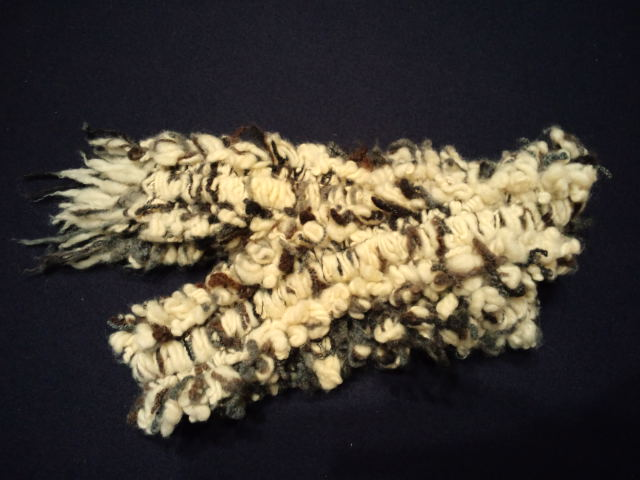

仙台からのバスを降りる時、手に持ったマフラーの他に何か別の感触が。 
 
「ん？」 
 
バスチケットを機械に入れて、ふと手元を見ると、 
 
『レディース席』と書かれた黄色い布（新幹線やバスの座席で頭部分にある布のシート）がマフラーにくっついてきた・・・マジックテープパワーだよ・・・ 
 
久しぶりにやらかした自分がおもしろくてニコニコしながら運転手さんに「すみません、持ってきちゃいました♪」とレディース席を返したところ、無表情の運転手さん。 
笑うのを我慢したのか、日常茶飯事なのか。 
 
 
 
 
話は変わって、 
今日初めて知った事実。 
 
かなづちの人が２５ｍ泳げるようにがんばる！というのをテレビでやっていた。 
それを観ていた父が「よくわかるな～この気持ち」と言ったもんで、 
運動神経は飛び抜けてイイ父がどこにくいついたかイマイチわからず、 
一瞬でいろいろ分析？した結果出た私の質問「もしかしてお父さん泳げないの？？？」 
「そう。泳げない。」 
 
えー！！！！！そうなの！？そうだったの！？知らなかったわよ！？ 
 
父が小中学生の時には学校にプールもなく、山奥だから夏も短い。 
確かに泳ぐ機会はないですねぇ。 
 
 
知らないことがまだまだありそう。 
 
 
今日の主役 
マフラー 

     